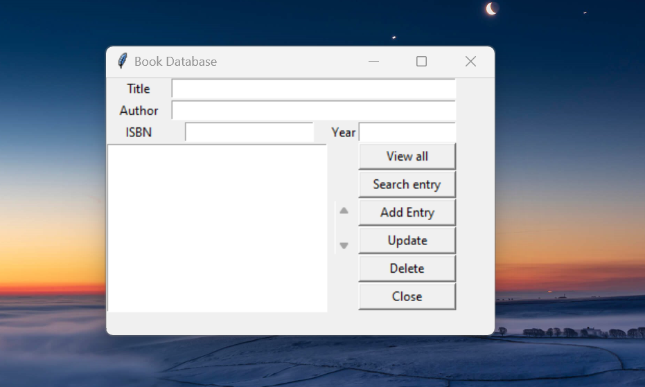

# Book Database

 
 

 

<b>A Book Database app for storing records of books in a library</b>

 

## ➡️ Description
This is a Book Database app for storing records of books in a library built with python using the GUI package Tkinter. 
Built this app while learning GUI development using python and sqlite3 as database. 
The application was converted to an executable file (.exe) using the pyinstaller package. 
It has four data fields namely: **Title**, **Author**, **ISBN** and **Year**. 

The app is able to: 
* Add a new book to the database
* View all books stored in the database
* Search for a book using any of the entries
* Update information for any existing book
* Delete a book data from the database
  

## ➡️ Languages | Technologies

<table>
  <tr>
    <td>Programming Languages</td>
    <td>Python</td>
  </tr>
  <tr>
    <td>Frameworks</td>
    <td>Tkinter</td>
  </tr>
  <tr>
    <td>Database</td>
    <td>Sqlite3</td>
  </tr>
</table>
 

## ➡️ Installation
* Clone or download this repository

Method 1
* Open the dist folder and run frontend.exe

Method 2
* Ensure python is installed on your system
* Run python frontend.py

